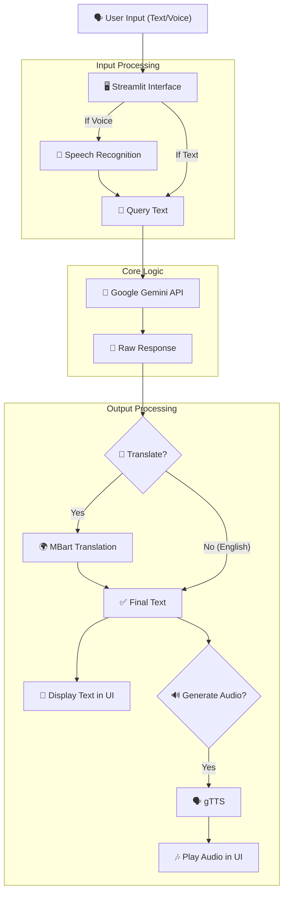

<div align="center">

# 🤖 MinerlexAI 💎  
**AI-Powered Multilingual Assistant for Mining Law**

[](https://opensource.org/licenses/MIT)  
  


</div>

---

**MinerlexAI** simplifies understanding **Mining Laws** using AI. It combines **Google Gemini** for legal Q&A, **MBart** for translation, and **gTTS** for voice output — offering support in multiple Indian languages.

---

## ✨ Features

- 🧠 **AI Legal Assistant**: Uses Google Gemini to answer mining law queries accurately.
- 🌍 **Multilingual Support**: Translates answers into 12+ Indian languages via MBart50.
- 🔊 **Text-to-Speech**: Converts text responses into audio using gTTS.
- 🎙️ **Voice Interaction**: Allows users to ask questions using a microphone.
- 📄 **PDF Ready**: UI supports PDF uploads (backend coming soon).
- 💡 **Interactive UI**: Built with Streamlit for a smooth user experience.

---

## 🛠️ Tech Stack

| Tool / Library                          | Purpose                          |
|----------------------------------------|----------------------------------|
| **Streamlit**                          | Interactive Web UI               |
| **Google Gemini** (`google.generativeai`) | Core Q&A Generation          |
| **MBart50** (HuggingFace Transformers) | Neural Machine Translation       |
| **gTTS** (Google Text-to-Speech)       | Speech Synthesis                 |
| **SpeechRecognition**                  | Voice Input Processing           |
| **python-dotenv**                      | Environment Variables Management |
| **PyTorch**                            | ML Backend for MBart             |

---

## ⚙️ Application Workflow



---

## 📦 Installation Guide

### 1. Clone the Repository

```bash
git clone https://github.com/yourusername/minerlexai.git
cd minerlexai
```

### 2. Set Up Virtual Environment (Recommended)

```bash
# Create virtual environment
python -m venv venv

# Activate environment
# Linux/macOS
source venv/bin/activate

# Windows
venv\Scripts\activate
```

### 3. Install Dependencies

```bash
pip install -r requirements.txt
```

*(Make sure `requirements.txt` lists all necessary packages.)*

### 4. Configure Environment Variables

Create a `.env` file in the root directory:

```env
# .env file
GEMINI_API_KEY=YOUR_GOOGLE_GEMINI_API_KEY_HERE
```

---

## 🚀 Run the Application

```bash
streamlit run app.py
```

Then, visit [http://localhost:8501](http://localhost:8501) in your browser.

---

## 🌐 Supported Languages

MinerlexAI supports translation to and from English for the following Indian languages (MBart50 codes):

- Hindi (hi_IN) – हिन्दी  
- Bengali (bn_IN) – বাংলা  
- Tamil (ta_IN) – தமிழ்  
- Telugu (te_IN) – తెలుగు  
- Marathi (mr_IN) – मराठी  
- Gujarati (gu_IN) – ગુજરાતી  
- Malayalam (ml_IN) – മലയാളം  
- Kannada (kn_IN) – ಕನ್ನಡ  
- Odia (or_IN) – ଓଡ଼ିଆ  
- Urdu (ur_PK) – اردو *(Note: MBart uses Pakistan locale)*  
- Assamese (as_IN) – অসমীয়া  
- *... and more supported by MBart50*

---

## 📝 Important Notes

- 🔑 **API Key**: A valid Google Gemini API key is required. Get one from [Google AI Studio](https://aistudio.google.com/).
- 🎤 **Microphone**: Browser permissions are needed for voice input.
- ⏳ **Model Download**: MBart50 (~2.4 GB) will be downloaded on first use — please wait.
- 📄 **PDF Feature**: UI supports PDF uploads, but backend implementation (like parsing and RAG) is pending.

---

## 🙌 Contributing

We welcome contributions! To get started:

1. Fork the project  
2. Create a new branch:  
   ```bash
   git checkout -b feature/AmazingFeature
   ```
3. Commit your changes:  
   ```bash
   git commit -m "Add AmazingFeature"
   ```
4. Push to the branch:  
   ```bash
   git push origin feature/AmazingFeature
   ```
5. Open a Pull Request

Feel free to open an issue for discussion!

---

## 📄 License

Distributed under the **MIT License**. See the `LICENSE` file for details.

---

<div align="center">

## 👤 Author

Built with ❤️ by **Mrinal**  
[GitHub Profile](https://github.com/Whisplnspace)

</div>

